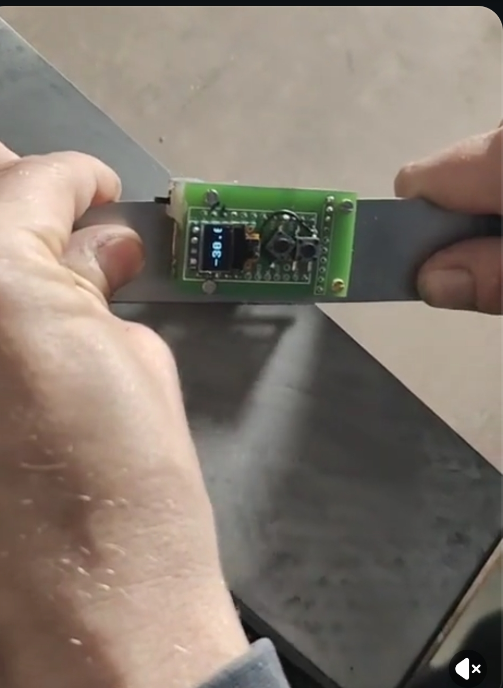

# Knife Level

A small digital level for knife sharpening. Measures blade surface inclination in real time using a 9-DOF IMU, displays the angle on an OLED, and alerts you when you drift from your target sharpening angle.

 Built on MicroPython running on an nRF52840 microcontroller with two buttons, a LiPo battery, and a custom PCB. 

Here is a [demo vid of the sensor responsiveness](https://imgur.com/a/BOzFHaE).
Here is a [demo vid of the Android app](https://imgur.com/a/6ULBu0x).

Commercial use and resale are not permitted.

## License

- Software code, documentation, images, and hardware design files: [CC BY-NC 4.0](LICENSE)
- Third-party subcomponents may use their own license where noted (for example, `kicad/nice-nano-kicad/`)

### Third-party notices

- `kicad/nice-nano-kicad/` is a third-party nice!nano symbol/footprint library bundled with this project.
- The bundled library declares `GNU GPLv3` in `kicad/nice-nano-kicad/README.md`; keep that notice and attribution when redistributing those files.

> **Disclaimer:** This project is provided as-is, without warranty of any kind. The author is not liable for any damage, injury, or loss arising from the use, misuse, or inability to use this project or any hardware built from it.

## Getting Started

1. [Assemble the hardware](docs/HOW_TO_HARDWARE.md)
2. [Flash the firmware](docs/HOW_TO_FIRMWARE.md)
3. Optionally install the Android companion app from the `knife_level_android_apk` workflow artifact

If impatient, go over [Quick Start](docs/QUICK_START.md).

For a detailed explanation of how board levelling, calibration, and angle calculation work — including the math — see [Angle Math](docs/ANGLE_MATH.md).

## Acknowledgements

Thanks to [jkorte-dev](https://github.com/jkorte-dev) for publishing the nRF52840 SuperMini/Nice!Nano MicroPython board definitions and UF2 builds used as a flashing base.

Development was assisted by [Claude](https://claude.ai) (Anthropic).

## Features

- **Live sharpening angle** — displays current blade surface inclination in real time on the OLED
- **Rotation-invariant measurement** — the sensor attaches to the blade with a magnet and can spin freely on the blade face; the reading reports the correct blade angle regardless of how the sensor is rotated on the surface
- **Session calibration** — set the current surface as zero from the on-device settings menu or the Android app
- **Visual alert** — display inverts when you drift more than the configured threshold from the target angle; threshold supports decimal values (e.g. 0.5°)
- **Battery display** — shows battery percentage on startup
- **Preset angle profiles** — define named knives and their angles in `angles.csv`; select them on-device with the top button, with optional restore of the last selected preset after reboot
- **Calibration + presets are independent** — calibrate once to set your physical reference point (zero), then switch between knife presets freely; each preset angle is always displayed relative to the calibration, never compounding
- **Expanded two-button controls** — short-press low = settings menu (`Calib`, `Level`, `Bluetooth`), short-press top = preset menu, long-press top = angle-format menu, short-press both = flash mode
- **Selectable angle display format** — choose `2 decimals`, `1 decimal`, or `0/5 steps` (nearest 0.5) directly on-device; setting is stored in flash and restored on boot
- **Automatic reboot after persistent changes** — board-levelling save/reset and angle-format changes reboot the MCU automatically so the new setting takes effect immediately
- **Flash mode** — short-press both buttons simultaneously to drop to REPL for flashing without unplugging (to exit flash mode, reset via RST↔GND or power-cycle the device)
- **Physical power switch** — B+ latch switch replaces soft power off
- **Board levelling** — captures the full 3D surface normal once when placed flat; stored in flash and applied automatically on every boot, making readings accurate regardless of sensor mounting orientation
- **Bluetooth companion app** — configure display/behavior settings over BLE, calibrate from the phone, manage preset angles with CRUD operations, and back up/restore presets plus app-exposed settings after reflashing

